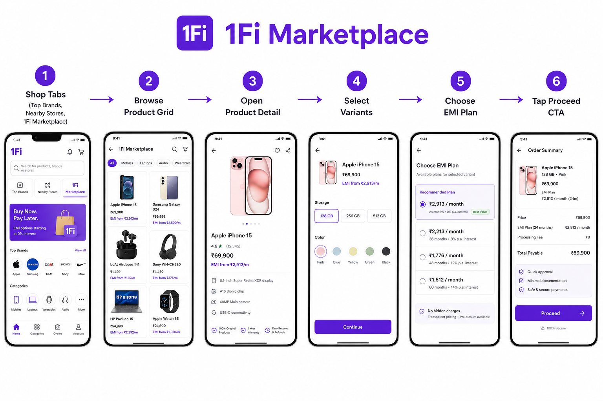
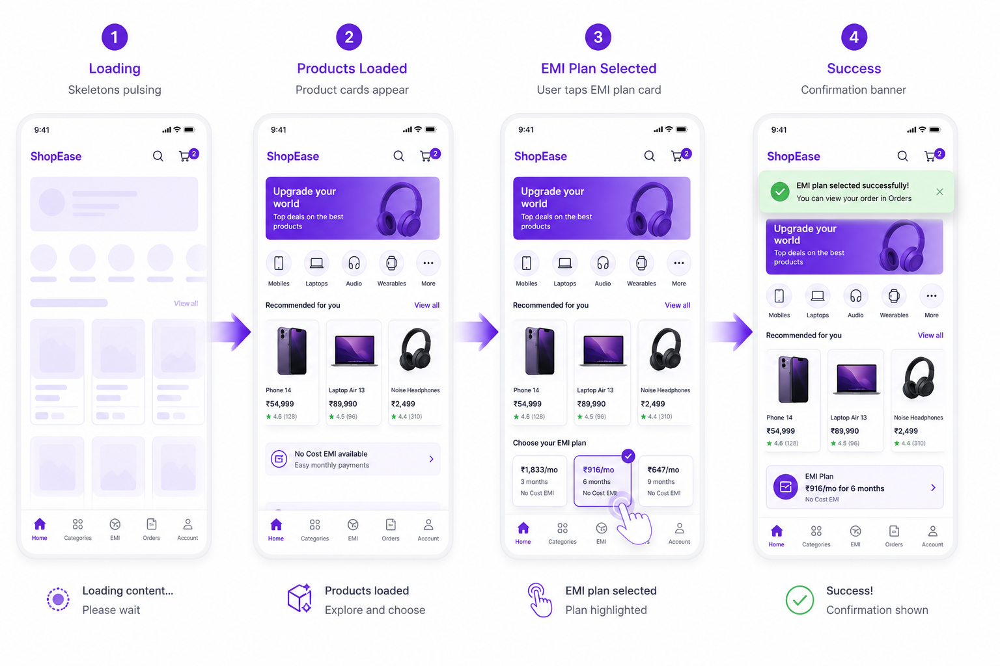
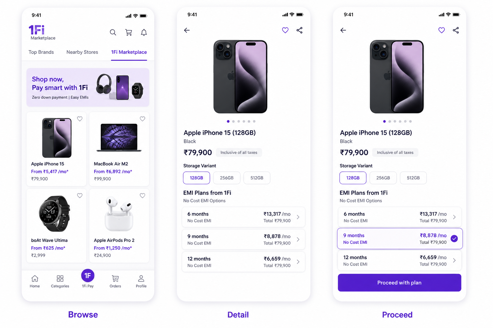
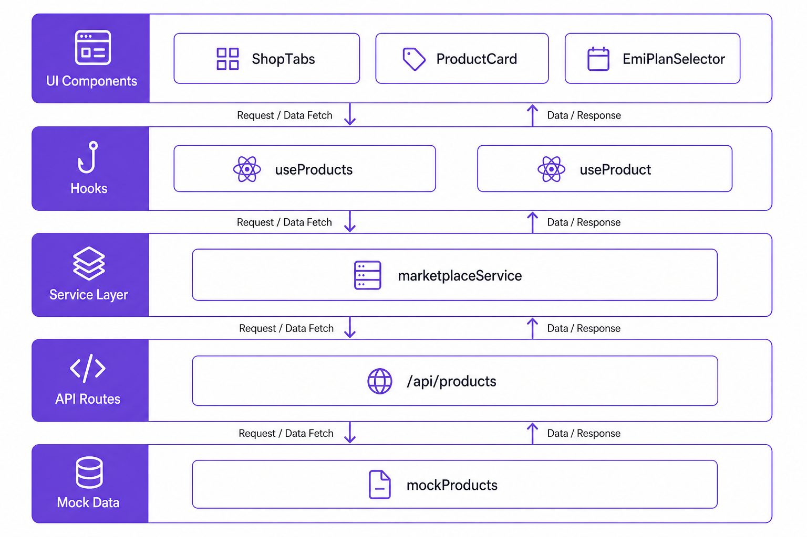
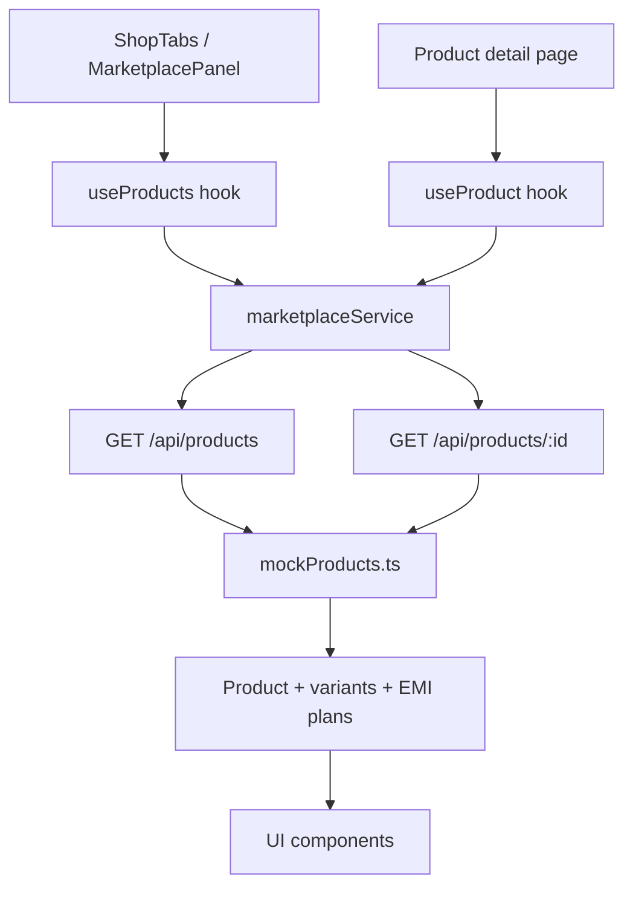
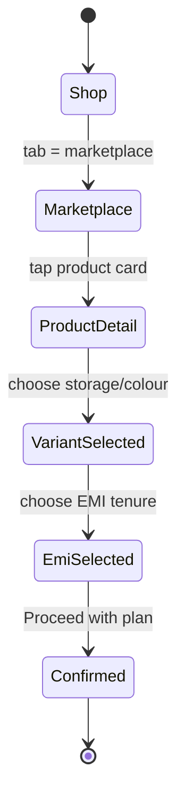

# 1Fi SDE Intern Assignment — Marketplace

> **Status:** Complete and verified working (`npm run build` ✅ · live routes `200` ✅ · EMI + Proceed flow ✅)

Implementation of the **1Fi Marketplace** section inside the Shop experience, based on  
[`1Fi SDE Intern Assignment.pdf`](./1Fi%20SDE%20Intern%20Assignment.pdf).

---

## Table of contents

1. [Assignment coverage checklist](#1-assignment-coverage-checklist)
2. [How it works (visual flow)](#2-how-it-works-visual-flow)
3. [Animated working flow](#3-animated-working-flow)
4. [Screen journey](#4-screen-journey)
5. [Architecture & data flow](#5-architecture--data-flow)
6. [Project structure](#6-project-structure)
7. [Run locally](#7-run-locally)
8. [API reference (mock)](#8-api-reference-mock)
9. [Verification report](#9-verification-report)
10. [Tech decisions](#10-tech-decisions)

---

## 1. Assignment coverage checklist

| Requirement from PDF | Status | Where it lives |
| --- | --- | --- |
| Shop page with **Top Brands** | ✅ Placeholder (allowed) | `src/components/shop/TopBrandsPanel.tsx` |
| Shop page with **Nearby Stores** | ✅ Placeholder (allowed) | `src/components/shop/NearbyStoresPanel.tsx` |
| Shop page with **1Fi Marketplace** | ✅ Fully implemented | `src/components/shop/MarketplacePanel.tsx` |
| Product listing | ✅ | `ProductList` + `ProductCard` |
| Product image | ✅ | Card + detail hero |
| Product name | ✅ | Card + detail |
| Product pricing | ✅ | Base price, MRP, discount |
| Product variants | ✅ | `VariantSelector` |
| EMI options / plans | ✅ | `EmiPlanSelector` |
| Relevant product details | ✅ | Description + highlights |
| Select an EMI plan | ✅ | Plan cards (stateful) |
| CTA to proceed with selected plan | ✅ | `ProceedCta` |
| No hardcoding data in UI | ✅ | UI → hooks → service → API → mock data |
| Mock APIs for products / EMI | ✅ | `/api/products`, `/api/products/[id]` |
| Loading states | ✅ | Skeletons |
| Error states | ✅ | `ErrorState` + retry |
| Responsiveness | ✅ | Mobile-first max-width shell |
| UI consistency with 1Fi | ✅ | Brand purple `#712CDC`, Geist, app shell |

> **Note:** The PDF mentions attached reference screens. Only the written brief was available in this workspace, so UI follows the written requirements + public 1Fi brand cues (`theme-color: #712CDC`).

---

## 2. How it works (visual flow)

### End-user journey



**Step-by-step**

1. Open **Shop**
2. Switch among **Top Brands / Nearby Stores / 1Fi Marketplace**
3. Browse the **Marketplace product grid** (loaded from API)
4. Open a **product detail** page
5. Choose **variants** (storage / colour / config)
6. Select an **EMI plan**
7. Tap **Proceed with plan** → confirmation message

---

## 3. Animated working flow

Open this animated SVG in a browser (GitHub also renders SVG animation):


### UI state animation strip



What you will see in the live app:

| Interaction | Animation / motion |
| --- | --- |
| Product grid load | Skeleton pulse → cards fade in |
| Product card hover | Soft scale + border highlight |
| Tab switch | Active pill color transition |
| EMI plan select | Highlighted border / soft purple fill |
| Proceed CTA | Sticky bottom bar updates selected EMI |

---

## 4. Screen journey



### Live paths

| Screen | URL |
| --- | --- |
| Shop → Marketplace (default) | `/shop?tab=marketplace` |
| Shop → Top Brands | `/shop?tab=top-brands` |
| Shop → Nearby Stores | `/shop?tab=nearby-stores` |
| Product detail | `/marketplace/[productId]` e.g. `/marketplace/iphone-16-pro` |

---

## 5. Architecture & data flow



### Mermaid — runtime data path



### Mermaid — purchase selection flow



**Why this structure?**

- UI never imports mock catalog directly
- Easy to replace mock route handlers with a real backend later
- Hooks own loading / error / refetch state
- Components stay reusable and presentation-focused

---

## 6. Project structure

```text
src/
├── app/
│   ├── shop/page.tsx                 # Shop shell + tabs
│   ├── marketplace/[productId]/     # Product + EMI + CTA
│   └── api/products/                 # Mock REST APIs
├── components/
│   ├── layout/                       # AppShell, Header, BottomNav
│   ├── shop/                         # TopBrands / Nearby / Marketplace panels
│   ├── marketplace/                  # Cards, variants, EMI, CTA
│   └── ui/                           # Button, Skeleton, Error, Empty
├── hooks/                            # useProducts, useProduct
├── services/marketplaceService.ts    # Client API layer
├── data/mockProducts.ts              # Catalog source (API-only)
├── types/marketplace.ts
├── theme/tokens.ts
└── lib/                              # formatCurrency, cn

docs/images/                          # Flow + animation visuals used in README
```

---

## 7. Run locally

```bash
npm install
npm run dev
```

Then open: [http://localhost:3000](http://localhost:3000)

Home redirects to `/shop?tab=marketplace`.

### Other scripts

```bash
npm run build   # production build
npm run start   # serve production build
npm run lint    # eslint
```

---

## 8. API reference (mock)

| Method | Endpoint | Response |
| --- | --- | --- |
| `GET` | `/api/products` | `{ products: Product[], total: number }` |
| `GET` | `/api/products/:id` | `{ product: Product }` or `404` |

Each product includes:

- `imageUrl`, `name`, `basePrice`, `mrp`
- `variants[]`
- `emiPlans[]` (tenure, monthly amount, no-cost flag)
- `highlights[]`, `badges[]`

Artificial delay (~400–450ms) is included so loading skeletons are visible.

---

## 9. Verification report

Verified on local machine during this session:

| Check | Result |
| --- | --- |
| `npm run build` | ✅ Compiled successfully |
| `GET /shop?tab=marketplace` | ✅ `200` |
| `GET /shop?tab=top-brands` | ✅ `200` |
| `GET /shop?tab=nearby-stores` | ✅ `200` |
| `GET /api/products` | ✅ `200` · `total = 6` |
| `GET /api/products/iphone-16-pro` | ✅ `200` · 4 EMI plans |
| `GET /marketplace/iphone-16-pro` | ✅ `200` |
| Browser: product grid renders | ✅ |
| Browser: variants + EMI + Proceed | ✅ confirmation appears |

### Manual test script

1. Run `npm run dev`
2. Open Shop → confirm three tabs
3. Marketplace shows product cards with price + EMI from
4. Open **iPhone 16 Pro**
5. Change storage / colour
6. Select a longer EMI tenure (e.g. 24 months)
7. Tap **Proceed with plan**
8. Confirm success banner text appears

---

## 10. Tech decisions

| Choice | Reason |
| --- | --- |
| **Next.js 15 + React 19 + TypeScript** | Matches 1Fi’s public web stack cues (Next / React / TS / Capacitor-ready) |
| **Tailwind CSS v4** | Fast UI iteration, consistent spacing |
| **Brand `#712CDC`** | Matches 1Fi `theme-color` |
| **Route handlers as mock APIs** | Satisfies “dynamic data, no UI hardcoding” |
| **Mobile-first app shell** | Mirrors Shop-in-app experience from the assignment |

---

## Docs assets

| File | Purpose |
| --- | --- |
| `docs/images/flow-user-journey.png` | End-to-end user journey diagram |
| `docs/images/flow-architecture.png` | Layered architecture diagram |
| `docs/images/flow-screens.png` | Browse / Detail / Proceed storyboard |
| `docs/images/flow-animation-states.png` | Loading → success animation strip |
| `docs/images/flow-animated.svg` | Looping animated flow (open in browser) |

---

## Scope note

This repository does **not** redesign the whole 1Fi app. It focuses on the assignment goal:

> Build the **1Fi Marketplace** section within the existing Shop experience.
